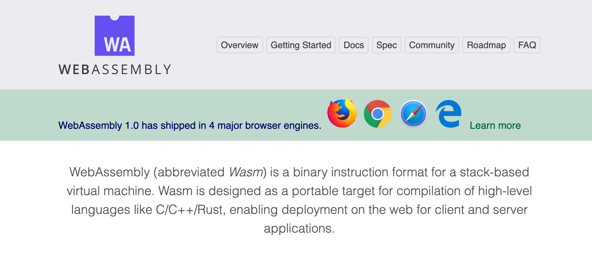
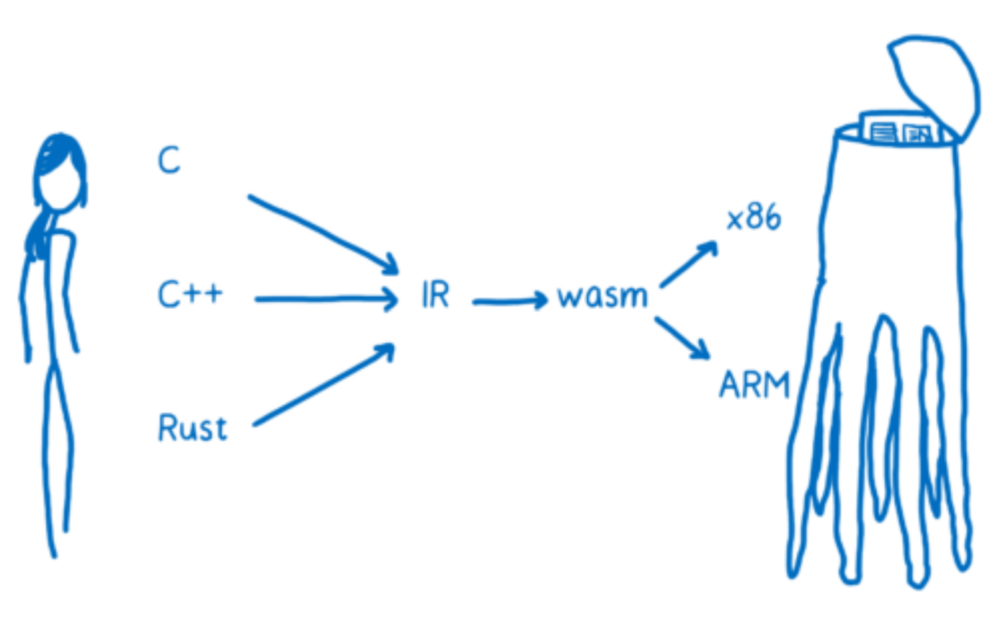
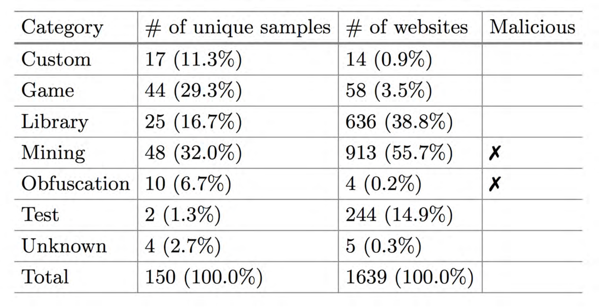
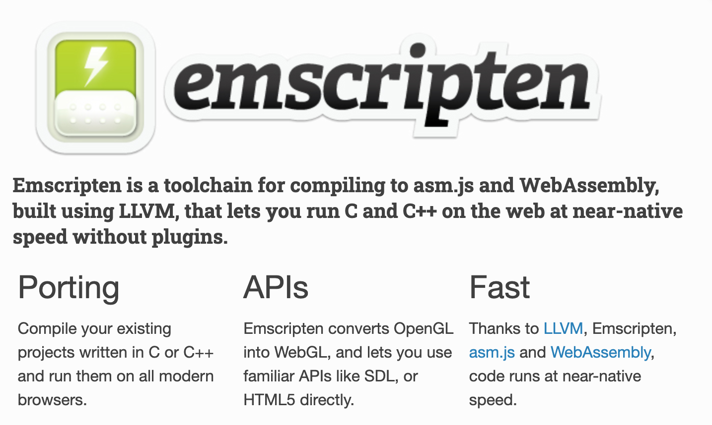
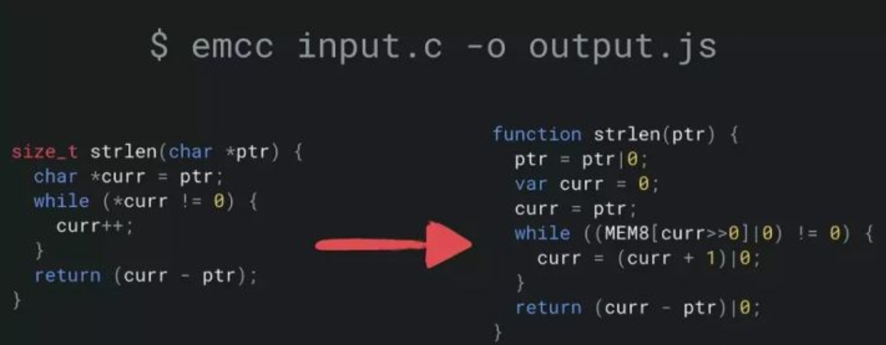
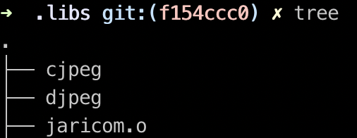
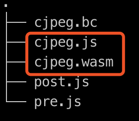
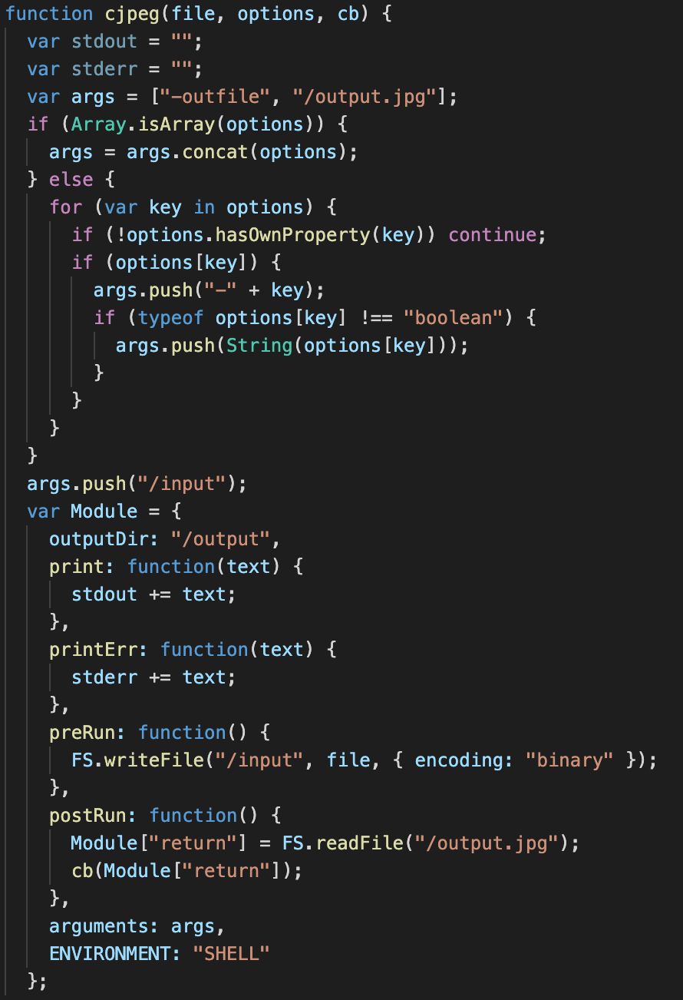
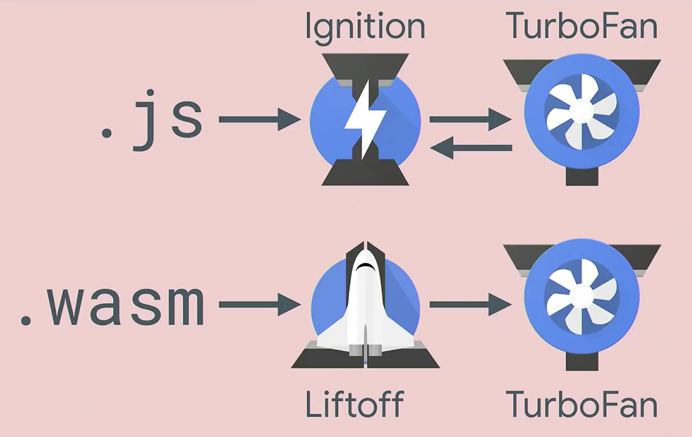
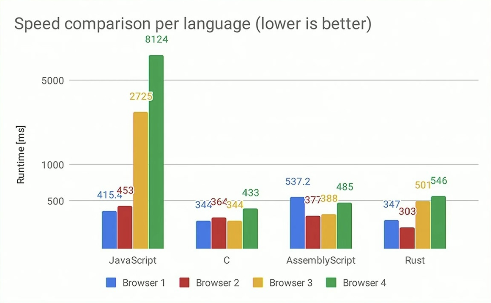

# WebAssembly 现状与实战

---

# 关于我

- 齐云江（大齐）
- CMUX 前端工程师
- 互动漫画工厂
- 爱好：动漫、炉石、撸猫


---

<style scoped>
ul { margin-left: 320px }
</style>

# 大纲

- WebAssembly 定义
- WebAssembly 案例
- Emscripten 简介
- Emscripten 实战
- WebAssembly 与 JavaScript
- 总结

---


https://webassembly.org/

---

# 定义

- WebAssembly（缩写为 Wasm）是基于堆栈的虚拟机的二进制指令格式。
- Wasm 被设计为可编译高级语言（如 C/C++/Rust）的可移植目标，从而可以在 Web 上为客户端和服务器应用程序进行部署。

---


https://code-cartoons.com/@linclark

---

# 案例

| 项目         | 网址                          | 描述     |
| ------------ | ----------------------------- | -------- |
| Google Earth | https://www.google.com/earth/ | 地球仪   |
| Figma        | https://www.figma.com/        | 协同设计 |
| Autocad      | https://web.autocad.com/      | CAD      |
| Clipchamp    | https://clipchamp.com/        | 视频编辑 |
| Soundation   | https://soundation.com/       | 音频编辑 |
| Unity        | https://unity.com/            | 游戏引擎 |
| 白鹭引擎     | https://www.egret.com/        | 游戏引擎 |

---

## 最新研究显示，50% 以上使用 WebAssembly 的 Web 站点将其用于恶意目的


https://www.dimva2019.org/wp-content/uploads/sites/31/2019/06/DIMVA19-slides-2-R.pdf

---

## 哪些语言可以编译成 wasm 呢？

| 项目                      | 编译工具       |
| ------------------------- | -------------- |
| C/C++                     | Emscripten     |
| C#/.Net                   | Blazor         |
| Rust                      | Wasm-pack      |
| AssemblyScript/TypeScript | AssemblyScript |
| Go                        | TinyGo         |
| ...                       | ...            |

https://github.com/appcypher/awesome-wasm-langs

---


https://emscripten.org

---

# Emscripten

* Emscripten 是使用 LLVM 构建的用于编译为 asm.js 和 WebAssembly 的工具链，可让您以几乎原生的速度在 Web 上运行 C 和 C++，而无需插件。



---

# Emscripten 实战

目标：用 MozJPEG 在 web 端压缩图片

---

## 步骤

1. 准备 Emscripten 安装环境
2. 安装 Emscripten
3. 编译 MozJPEG 到 LLVM bitcode
4. 编译 LLVM bitcode 到 WebAssembly

---

### 准备工作（以 Mac 环境为例）

1. git
2. Xcode
3. python 2.7.x
4. CMake

```
# 安装cmake
brew install cmake
```

---

### 下载并安装 emsdk

```
# 克隆到本地并进入目录
git clone https://github.com/emscripten-core/emsdk.git
cd emsdk

# 下载并安装最新的SDK tools.
./emsdk install latest

# 为此用户激活最新的SDK (写入 ~/.emscripten 文件)
./emsdk activate latest

# 配置环境变量，每次需要编译的时候配置一次
source ./emsdk_env.sh

# 校验编译成功
emcc --help
```

---

### 编译 MozJPEG 到 LLVM bitcode


```
# 克隆到本地并进入目录
git clone https://github.com/mozilla/mozjpeg.git
cd mozjpeg

# 切换到v3.3.1分支
git checkout v3.3.1

# 生成configure文件
autoreconf -fiv

# 编译配置
emconfigure ./configure --without-simd --without-turbojpeg CC="emcc"

# 编译
make
```

<style scoped>
img { position: absolute; right: 100px; top: 45% }
</style>


---

### 编译 LLVM bitcode 到 WebAssembly

```
# 创建一个干净的目录并进入
mkdir buildwasm
cd buildwasm

# 把上一步的cjpeg复制过来改为.bc后缀！
cp ../.libs/cjpeg cjpeg.bc

# 编译
emcc cjpeg.bc \
  -03\
  -s ALLOW_MEMORY_GROWTH=1 \
  -o cjpeg.js \
  --pre-js pre.js --post-js post.js \
  -L'../.libs' -ljpeg
```

<style scoped>
img { position: absolute; right: 100px; top: 40% }
</style>



---
<style scoped>
li { font-size: 28px; }
</style>

### 前后置钩子解释



1. pre.js 和 post.js
   [pre.js]--[生成的 wasm/asm.js]--[post.js]
   完善 js 和 wasm 之间的交互。

2. Module 对象
   Module 是一个特殊全局对象，当我们执行最终的 wasm/asm.js 文件时，在不同的阶段，程序会自动调用 Module 下不同的方法。

3. File System API
   emscripten 为我们提供了一套文件系统 api，通过这套 API，就可以用 ArrayBuffer，Web File 等方法来创建文件，并将这个文件写入 emscripten 为我们提供的一个虚拟文件系统。

---

## MozJPEG 效果展示


---

### 其他 DEMO 展示

1. OpenCV 人脸识别

2. FFmpeg 视频截图

---

# WebAssembly 和 JavaScript

---

## 在浏览器引擎如何工作



---

## 4 种语言的运行速度



---

# 总结


1. wasm 模块与 js 通讯的性能不高，不适合交互比较频繁的场景，更适合一次性把大量数据传给 wasm 模块来计算，然后一次性返回结果的这种计算密集型的场景。

2. wasm 不易拆包和调试，需要手动进行垃圾回收。

3. wasm 只是一种工具，而不是 js 的替代品，根据实际情况增强和优化 web 体验。

---

# 未来

1. 未来支持的特性

   - 直接操作 DOM
   - 共享内存的并发性
   - SIMD（单指令，多数据）
   - 异常处理

2. 让 web 之外调用

   - WASI（The WebAssembly System Interface）

---

# 调用一切

# THANKS
